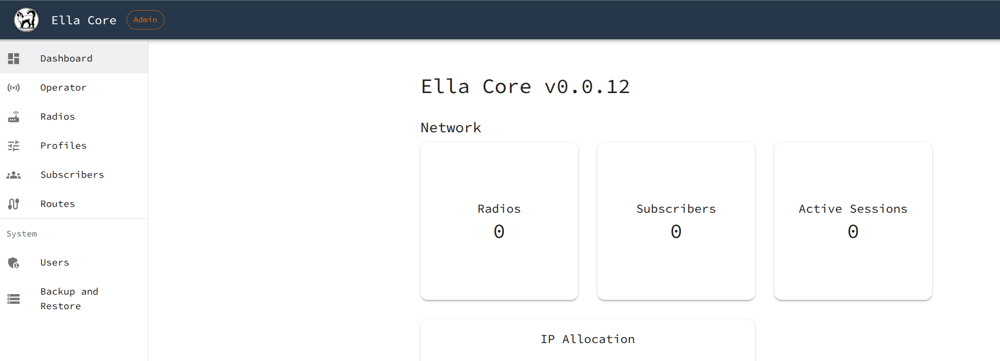

# Ella Core Operator (K8s)

[Ella Core](https://github.com/ellanetworks/core) is a 5G mobile core network designed for private deployments. It consolidates the complexity of traditional 5G networks into a single application, offering simplicity, reliability, and security.

The Ella Core operator for Kubernetes is a Juju charm allowing lifecycle operations of Ella Core on Kubernetes.

## Getting Started

### 1. Install the infrastructure

Install Canonical K8s and Multus

```bash
sudo snap install k8s --classic --channel=1.32-classic/stable
sudo k8s bootstrap
sudo k8s kubectl apply -f https://raw.githubusercontent.com/k8snetworkplumbingwg/multus-cni/master/deployments/multus-daemonset-thick.yml
```

Install Juju and bootstrap a Juju controller

```bash
sudo snap install juju --channel=3/stable
juju add-k8s k8s-localhost
juju bootstrap k8s-localhost
```

Create a Juju model

```bash
juju add-model dev
```

### 2. Install Ella Core

Deploy Ella Core

```bash
juju deploy ella-core-k8s ella-core --channel=edge --trust
```

Wait for the application to be running. You can check the status with `juju status`.

```bash
guillaume@courge:~$ juju status
Model  Controller     Cloud/Region   Version  SLA          Timestamp
dev    k8s-localhost  k8s-localhost  3.6.4    unsupported  12:26:49-04:00

App        Version  Status  Scale  Charm          Channel  Rev  Address         Exposed  Message
ella-core           active      1  ella-core-k8s             0  10.152.183.161  no       

Unit          Workload  Agent  Address    Ports  Message
ella-core/0*  active    idle   10.1.0.87  
```

Note the IP address of the Ella Core application.

Fetch the username and password to access the Ella Core UI

```bash
juju show-secret ELLA_CORE_LOGIN --reveal
```

Open a browser and navigate to the Ella Core UI at `https://<IP_ADDRESS>:5002`. Use the username and password to log in.


